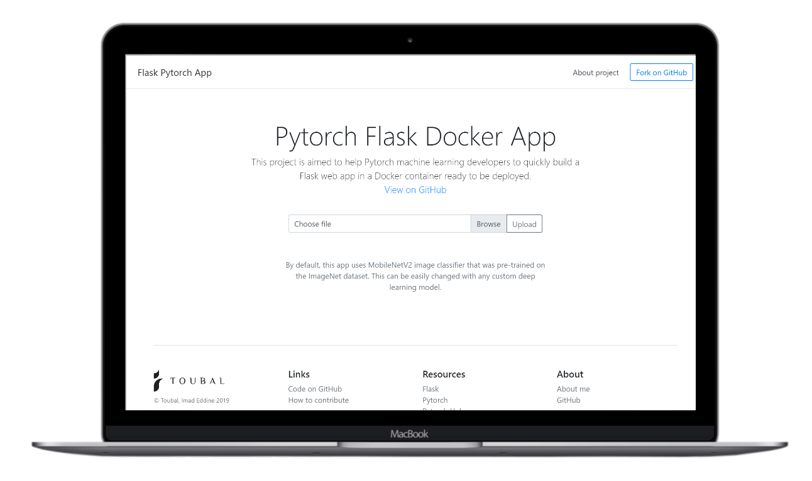

# Flask/Pytorch/Docker starter app

This project is aimed to help machine learning developers to quickly build and deploy a Flask web app that take advantage of their machine learning  ready PyTorch model. The documentation explains how to get up and running with either virtualenv or Docker.



This website is deployed in Heroku: https://flaskpytorch.herokuapp.com/

By default, this app uses MobileNetV2 image classifier that was pre-trained on the ImageNet dataset. This can be easily changed with any custom deep learning model.

## Getting Started (using Python virtualenv)

You need to have Python installed in your computer.

1. Install `virtualenv`: 
    ```
    pip install virtualenv
    ```
2. Create a Python virtual environment:
    ```
    virtualenv venv
    ```
3. Activate virtual environment:
    1. Windows:
    ```
    cd venv\Scripts
    activate
    cd ..\..
    ```
    2. Lunix / Mac:
    ```
    source venv/bin/activate
    ```
4. Install libraries:
   
   ```
   pip install -r requirements.txt
   ```

### Run the code

* Run the app:
    ```
    flask run
    ```
* Run on a specific port:
    ```
    flask run -p <port>
    ```

## Getting Started (using Docker)

1. Create a Docker image
    ```
    docker build -t pytorchflask .
    ```
    This will create an image with the name `pytorchflask`. You can replace that with a custom name for your app.

2. Run the docker image
    ```
    docker run -d -p 127.0.0.1:5000:80 pytorchflask
    ```
    This will run the app on port `5000`. You can replace that with which ever port that is more suitable.

## Deploying to Heroku

- Create Heroku app
    ```
    heroku create 
    git push heroku master
    ```
    
OR

- Add to existing Heroku app
    ```
    heroku git:remote -a <your-app-name>
    git push heroku master
    ```


## Changing the model

1. Go to `models.py`
2. Follow the structure of the class `MobileNet`to create a custom model class
3. Use your class in `app.py`

## Built With

* [Pytorch](https://pytorch.org/) - The Machine Learning framework used
* [Flask](http://flask.palletsprojects.com/en/1.1.x/) - The web server library

## Authors

* **Imad Eddine Toubal** - *Initial work* - [imadtoubal](https://github.com/imadtoubal)


## License

This project is licensed under the MIT License - see the [LICENSE](LICENSE) file for details


 Happy coding!
